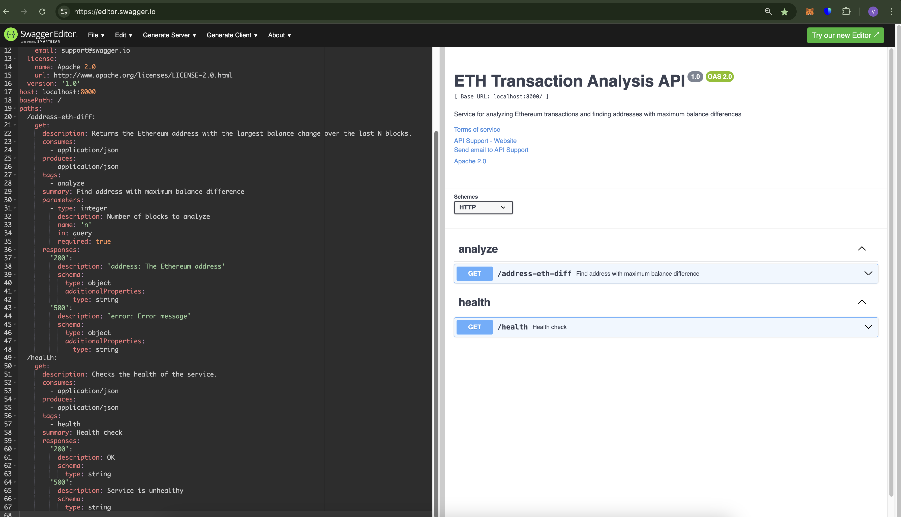
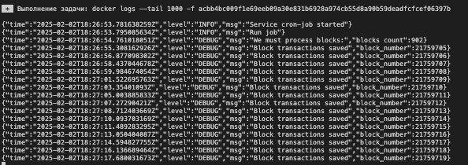
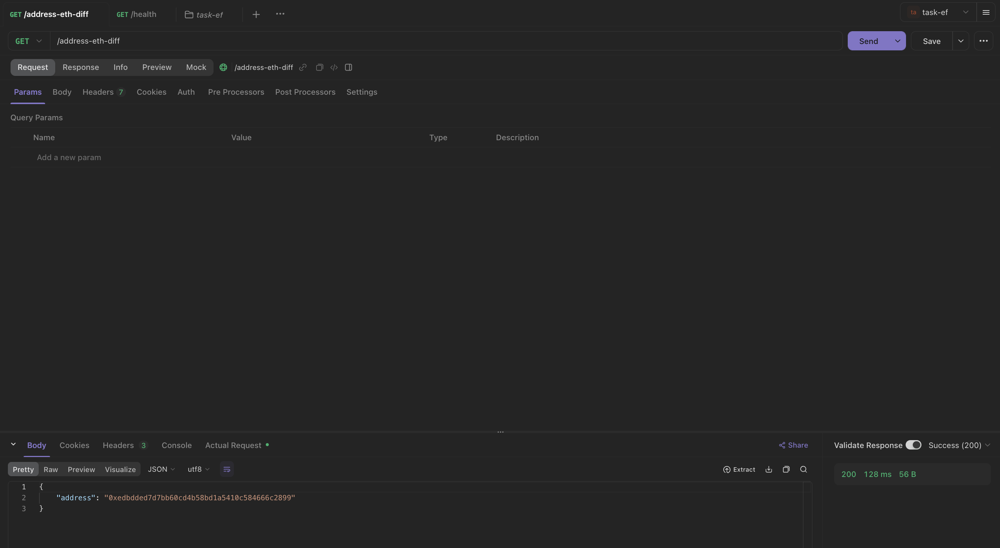

# Task EF


## Описание
Приложение состоит из двух частей:
- API
- CronJob


## Как запустить
Для запуска CronJob необхоимо:
1. Скопировать конфиг .env.example в .env
2. Указать в .env все необходимые параметры. Требуется обязательно указать ключ https://etherscan.io.
3. Запустктить команду:
```
make up
```
В результате будет запущены 3 сервиса:
- PostgreSQL
- CronJob
- API


## API
Информация о запросах к API доступна в документации:


Так выглядит работа cron-job:



Так выглядит запрос к API:
curl --location --request GET 'http://localhost:8000/address-eth-diff'
